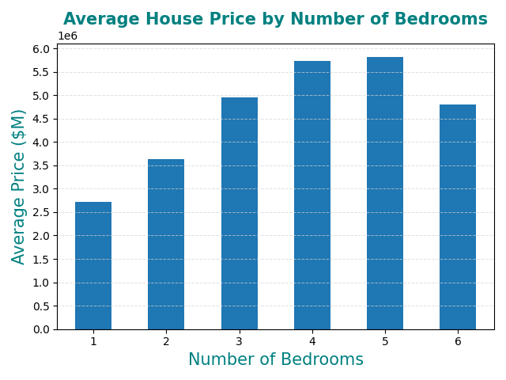
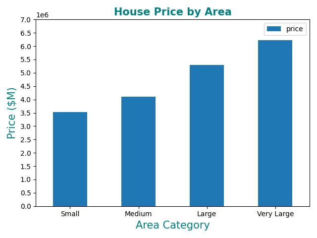
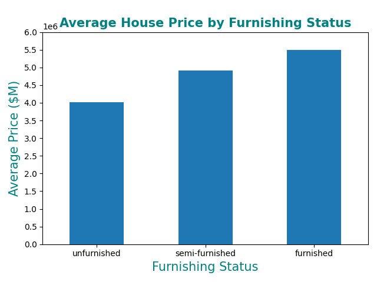

# house-price
Analysis of the prices of houses in a dataset

Visualization plots were generated based on prices analysis across three dimensions: number of bedrooms, area and furnishing status.

## Hypothesis
The analysis examines whether the number of bedrooms, house size (area), and furnishing status are factors influencing house prices. We hypothesize that area and furnishing status have strong positive correlations with price, while the relationship with bedrooms is more complex and may be influenced by other factors such as property location or construction type.

### Average House Price by Number of Bedrooms:
```
bedrooms
1    $2,712,500.00
2    $3,632,022.06
3    $4,954,598.13
4    $5,729,757.89
5    $5,819,800.00
6    $4,791,500.00
```

### Average House Price by Area Category:
```
area_category
Small         $3,536,093.75
Medium        $4,102,657.89
Large         $5,289,105.26
Very Large    $6,219,003.26
```

### Average House Price by Furnishing Status:
```
furnishingstatus
unfurnished       $4,013,831.46
semi-furnished    $4,907,524.23
furnished         $5,495,696.00
```

## Conclusion
The analysis confirms that **area and furnishing status are strong positive predictors of house price**. Houses with larger areas command significantly higher prices (ranging from $3.9M for small to $6.7M for very large), and furnished properties are 37% more expensive than unfurnished ones on average.

However, the relationship with **number of bedrooms is non-linear**. While prices generally increase from 1-5 bedrooms ($2.7M → $5.8M), there is a notable drop at 6 bedrooms ($4.8M), suggesting that bedroom count alone is not a reliable price predictor. This anomaly may be due to smaller sample size, different architectural designs, or property locations.

**Key Finding:** Area and furnishing are reliable proxies for house value, but bedroom count should be considered alongside other contextual factors when predicting price.

## Data Source
https://www.agentsfordata.com/csv/sample

## Dependencies
- pandas
- numpy
- matplotlib

## Plots




